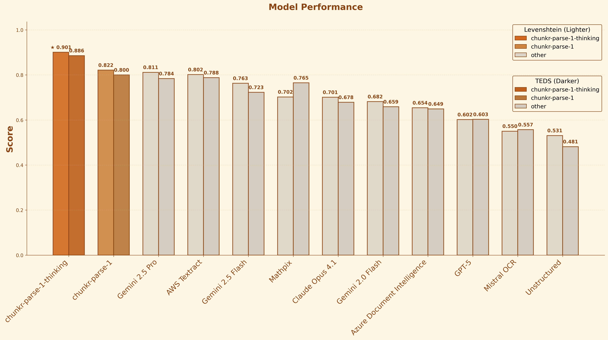
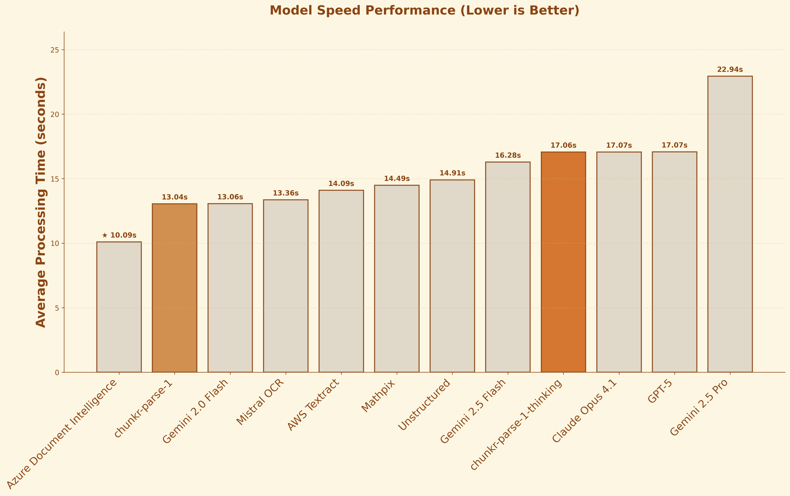
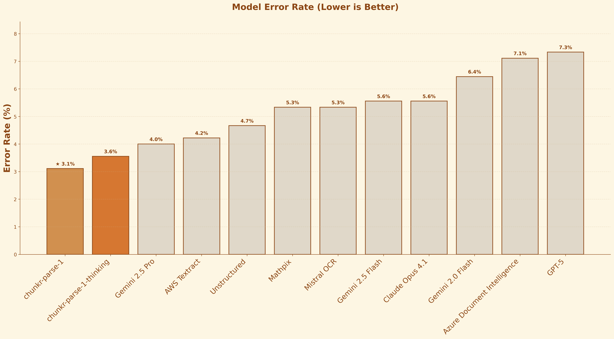
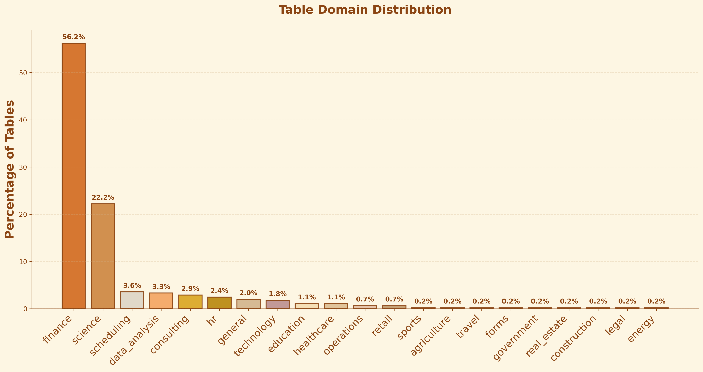
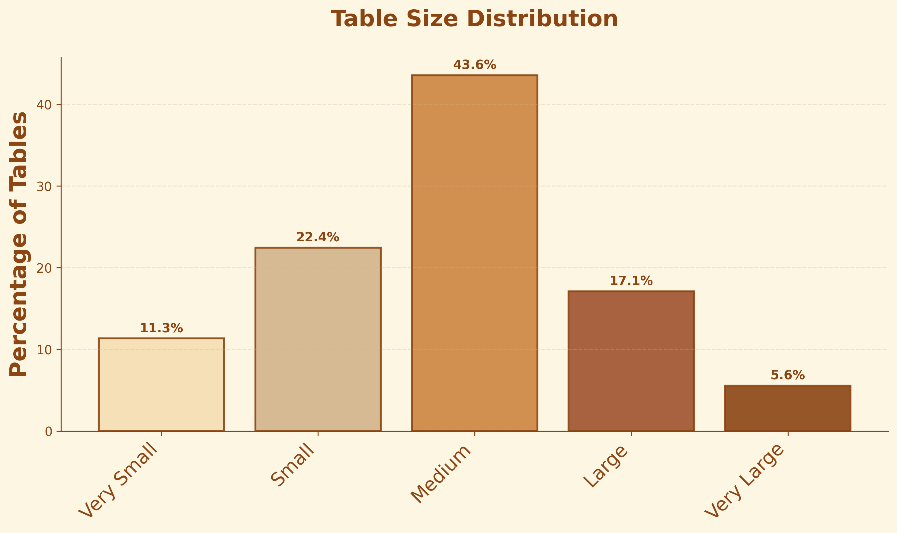
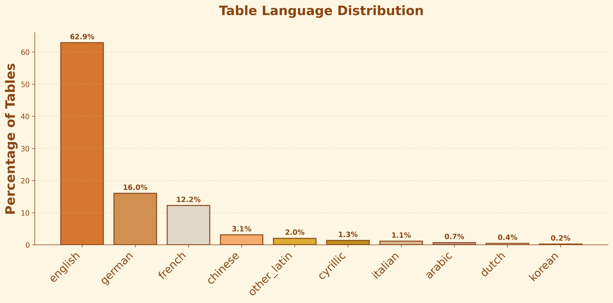
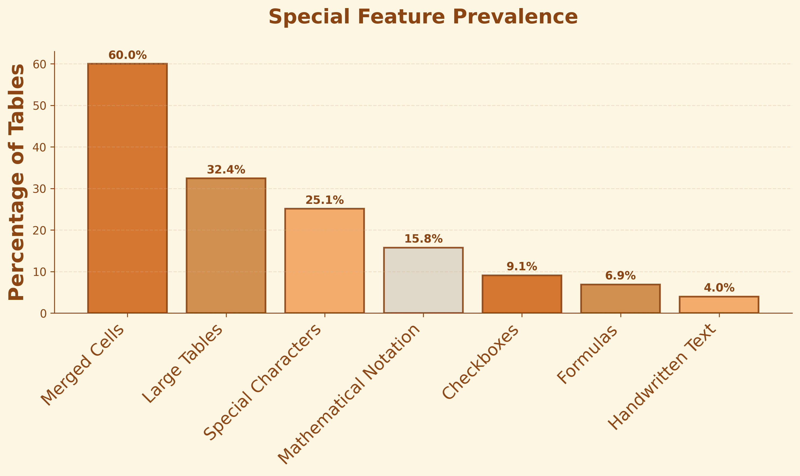

# Introducing chunkr-parse-1-thinking: The best VLM for Document OCR

We are thrilled to announce the release of a new document-native vision language model family for document parsing workflows, **chunkr-parse-1** and **chunkr-parse-1-thinking**. These models are purpose-built to parse individual components of PDFs - tables, forms, pictures, text OCR, formulas, and even full pages. The "thinking" variant is trained to reason over patches of PDF pages, allowing it to handle more complex cases. You can try both of these models now, on [our API](https://www.chunkr.ai).

## Key features

Our models introduce significant advancements in **accuracy**, **speed**, and **stability**. These models are specifically trained to handle the unique challenges of real-world documents, with comprehensive segment support optimized for all existing [Chunkr segment types](https://docs.chunkr.ai/pages/features/parse/outputs#chunks-and-segments) including tables, pictures, text, formulas, and other document elements.

• **Multilingual parsing** - Support for content across dozens of languages

• **Complex table extraction** - Handling merged cells and nested structures

• **Mathematical formula recognition** - Converting formulas to LaTeX format

• **Chart-to-table conversion** - Transforming visual charts into structured data

• **Complex figure recognition** - Analyzing graphs, architectural layouts, electrical boards, and technical diagrams

• **Cross-domain coverage** - Trained on documents from diverse industries:

- Financial reports and SEC filings
- Engineering specifications and datasheets
- Medical records and healthcare documentation
- Legal contracts and regulatory documents
- Government forms and public records
- Academic research papers
- Tax documents and returns
- Supply chain and logistics reports
- Construction blueprints and drawings
- Real estate listings and appraisals
- Consulting presentations and proposals
- Procurement documents and RFPs

### Accuracy

Table-to-HTML conversion represents one of the most challenging tasks in document processing, so we evaluated our models' performance using this task, on a comprehensive dataset of 500 publicly available tables with manually annotated HTML ground truth. These models deliver better accuracy and speed compared to other leading VLMs.

### Speed

The standard variant, **chunkr-parse-1**, is optimized for maximum throughput and the thinking variant, **chunkr-parse-1-thinking**, for performance. There is a clear quality-speed tradeoff. **chunkr-parse-1-thinking** still significantly outperforms other leading models like Gemini 2.5 Pro in both speed and accuracy.

### Stability

Both **chunkr-parse-1** and **chunkr-parse-1-thinking** achieve >98% success rates across our evaluation dataset. This is an improvement over general-purpose VLMs, which tend to hallucinate or produce malformed outputs when processing complex document structures.

## Benchmark

Table-to-HTML conversion represents a hard test of document understanding, requiring models to simultaneously handle OCR, structural reasoning, and complex layout preservation in a single measurable task.

After training our models, we collected 500 diverse samples for public benchmarking. Our dataset includes complex tables from many industry verticals, like finance, healthcare, engineering and more. We took care to source and include difficult, realistic examples with checkboxes, sparse/complex layouts, merged and split cells, and tables containing multilingual and unusual characters. Obviously, these samples were not seen by any of our models during training or validation.

### Dataset

Our evaluation dataset consists of 500 real-world table images spanning diverse domains and complexities. The dataset was carefully curated to represent the full spectrum of table extraction challenges encountered in practice.

**Domain Distribution**: The dataset covers a wide range of domains, with financial documents (30%) and business reports (25%) forming the largest segments, followed by scientific papers (20%), government forms (15%), and technical specifications (10%). This diversity ensures our benchmarks reflect real-world usage patterns across industries.

**Table Complexity**: Most tables fall into the medium complexity range (3-6 columns, 5-15 rows), which represents typical business use cases. However, we include challenging edge cases with large tables (>10 columns) and simple single-column lists to test processor robustness across the full spectrum of table structures.

**Language Coverage**: While English dominates (65%), our dataset includes significant representation of major world languages including Chinese (12%), Spanish (8%), German (6%), and others (9%). This multilingual approach ensures our findings are globally applicable and not biased toward English-only content.

**Special Features**: The dataset includes tables with challenging features like merged cells (45%), checkboxes/forms (25%), mathematical notation (20%), and multi-line cell content (30%). These features test processors' ability to handle real-world complexity beyond simple grid structures.

### Canonicalization

We first canonicalize both inputs so markup style cannot bias the scores. The pipeline parses the first table with `BeautifulSoup` and `lxml`, unwraps `thead` `tbody` `tfoot`, converts `th` to `td`, removes inline emphasis wrappers such as `b` `i` `strong` `em` `span`, sorts attributes for deterministic serialization, and collapses whitespace. This preserves the grid along with `rowspan` and `colspan` while stripping presentation noise.

### Metrics - TEDS for Structure, Levenshtein for Content

We evaluate each table with two signals that target different failure modes. Levenshtein alignment measures cell content accuracy. TEDS measures structural fidelity across rows columns and spans. Reading them together separates wrong values from broken layout.

**Levenshtein Alignment** measures cell content accuracy using character-level string similarity. We convert tables to 2D arrays, align cells using dynamic programming, and normalize scores. This metric is sensitive to content errors like wrong numbers or misspelled text, but tolerant of minor structural variations.

**TEDS (Tree Edit Distance Score)** measures structural fidelity using the SWHL package. It builds hierarchical trees representing the table → rows → cells structure, including rowspan and colspan attributes, then computes tree edit distance that penalizes inserted or deleted rows, columns, and incorrect span attributes before comparing cell text content. TEDS is highly sensitive to structural errors such as:

- Extra or missing columns/rows
- Incorrect cell spans (rowspan/colspan)
- Wrong table grid structure

#### Interpreting both

**Example 1: Structure Error**

| Ground Truth                                                                                                                                                                                                                                                                                                                                                                                                                                                                                                                                                                                                                                                                                                                                                                                                                                                                                                                                                   | Prediction (structure collapsed)                                                                                                                                                                                                                                                                                                                                                                                                                                                                                                                                                                               |
| -------------------------------------------------------------------------------------------------------------------------------------------------------------------------------------------------------------------------------------------------------------------------------------------------------------------------------------------------------------------------------------------------------------------------------------------------------------------------------------------------------------------------------------------------------------------------------------------------------------------------------------------------------------------------------------------------------------------------------------------------------------------------------------------------------------------------------------------------------------------------------------------------------------------------------------------------------------- | -------------------------------------------------------------------------------------------------------------------------------------------------------------------------------------------------------------------------------------------------------------------------------------------------------------------------------------------------------------------------------------------------------------------------------------------------------------------------------------------------------------------------------------------------------------------------------------------------------------- |
| **Rendered:** <table border="1" style="border-collapse: collapse;"><tr><td>Item</td><td>Price</td><td>Stock</td><td>Category</td></tr><tr><td>Apple</td><td>1.99</td><td>100</td><td>Fruit</td></tr><tr><td>Banana</td><td>0.89</td><td>150</td><td>Fruit</td></tr><tr><td>Carrot</td><td>1.29</td><td>80</td><td>Vegetable</td></tr></table>  **HTML:** <pre><code>&lt;table&gt; &lt;tr&gt;&lt;td&gt;Item&lt;/td&gt;&lt;td&gt;Price&lt;/td&gt;&lt;td&gt;Stock&lt;/td&gt;&lt;td&gt;Category&lt;/td&gt;&lt;/tr&gt; &lt;tr&gt;&lt;td&gt;Apple&lt;/td&gt;&lt;td&gt;1.99&lt;/td&gt;&lt;td&gt;100&lt;/td&gt;&lt;td&gt;Fruit&lt;/td&gt;&lt;/tr&gt; &lt;tr&gt;&lt;td&gt;Banana&lt;/td&gt;&lt;td&gt;0.89&lt;/td&gt;&lt;td&gt;150&lt;/td&gt;&lt;td&gt;Fruit&lt;/td&gt;&lt;/tr&gt; &lt;tr&gt;&lt;td&gt;Carrot&lt;/td&gt;&lt;td&gt;1.29&lt;/td&gt;&lt;td&gt;80&lt;/td&gt;&lt;td&gt;Vegetable&lt;/td&gt;&lt;/tr&gt; &lt;/table&gt;</code></pre> | **Rendered:** <table border="1" style="border-collapse: collapse;"><tr><td>Item Price Stock Category</td></tr><tr><td>Apple 1.99 100 Fruit</td></tr><tr><td>Banana 0.89 150 Fruit</td></tr><tr><td>Carrot 1.29 80 Vegetable</td></tr></table>  **HTML:** <pre><code>&lt;table&gt; &lt;tr&gt;&lt;td&gt;Item Price Stock Category&lt;/td&gt;&lt;/tr&gt; &lt;tr&gt;&lt;td&gt;Apple 1.99 100 Fruit&lt;/td&gt;&lt;/tr&gt; &lt;tr&gt;&lt;td&gt;Banana 0.89 150 Fruit&lt;/td&gt;&lt;/tr&gt; &lt;tr&gt;&lt;td&gt;Carrot 1.29 80 Vegetable&lt;/td&gt;&lt;/tr&gt; &lt;/table&gt;</code></pre> |

**Scores**: Levenshtein: 55.6%, TEDS: 26.2% - Levenshtein higher (content preserved), TEDS much lower (structure destroyed).

**Example 2: Content Error**

| Ground Truth                                                                                                                                                                                                                                                                                                                                                                                                                                                                                                                                                                                                                                                                                                                                                                                                   | Prediction (wrong content)                                                                                                                                                                                                                                                                                                                                                                                                                                                                                                                                                                                                                                                                                                                                                                                   |
| -------------------------------------------------------------------------------------------------------------------------------------------------------------------------------------------------------------------------------------------------------------------------------------------------------------------------------------------------------------------------------------------------------------------------------------------------------------------------------------------------------------------------------------------------------------------------------------------------------------------------------------------------------------------------------------------------------------------------------------------------------------------------------------------------------------- | ------------------------------------------------------------------------------------------------------------------------------------------------------------------------------------------------------------------------------------------------------------------------------------------------------------------------------------------------------------------------------------------------------------------------------------------------------------------------------------------------------------------------------------------------------------------------------------------------------------------------------------------------------------------------------------------------------------------------------------------------------------------------------------------------------------ |
| **Rendered:** <table border="1" style="border-collapse: collapse;"><tr><td>Country</td><td>Capital</td><td>Population</td></tr><tr><td>France</td><td>Paris</td><td>67M</td></tr><tr><td>Germany</td><td>Berlin</td><td>83M</td></tr><tr><td>Italy</td><td>Rome</td><td>60M</td></tr></table>  **HTML:** <pre><code>&lt;table&gt; &lt;tr&gt;&lt;td&gt;Country&lt;/td&gt;&lt;td&gt;Capital&lt;/td&gt;&lt;td&gt;Population&lt;/td&gt;&lt;/tr&gt; &lt;tr&gt;&lt;td&gt;France&lt;/td&gt;&lt;td&gt;Paris&lt;/td&gt;&lt;td&gt;67M&lt;/td&gt;&lt;/tr&gt; &lt;tr&gt;&lt;td&gt;Germany&lt;/td&gt;&lt;td&gt;Berlin&lt;/td&gt;&lt;td&gt;83M&lt;/td&gt;&lt;/tr&gt; &lt;tr&gt;&lt;td&gt;Italy&lt;/td&gt;&lt;td&gt;Rome&lt;/td&gt;&lt;td&gt;60M&lt;/td&gt;&lt;/tr&gt; &lt;/table&gt;</code></pre> | **Rendered:** <table border="1" style="border-collapse: collapse;"><tr><td>Country</td><td>Capital</td><td>Population</td></tr><tr><td>Mars</td><td>RedCity</td><td>0</td></tr><tr><td>Venus</td><td>HotTown</td><td>0</td></tr><tr><td>Jupiter</td><td>GasVille</td><td>0</td></tr></table>  **HTML:** <pre><code>&lt;table&gt; &lt;tr&gt;&lt;td&gt;Country&lt;/td&gt;&lt;td&gt;Capital&lt;/td&gt;&lt;td&gt;Population&lt;/td&gt;&lt;/tr&gt; &lt;tr&gt;&lt;td&gt;Mars&lt;/td&gt;&lt;td&gt;RedCity&lt;/td&gt;&lt;td&gt;0&lt;/td&gt;&lt;/tr&gt; &lt;tr&gt;&lt;td&gt;Venus&lt;/td&gt;&lt;td&gt;HotTown&lt;/td&gt;&lt;td&gt;0&lt;/td&gt;&lt;/tr&gt; &lt;tr&gt;&lt;td&gt;Jupiter&lt;/td&gt;&lt;td&gt;GasVille&lt;/td&gt;&lt;td&gt;0&lt;/td&gt;&lt;/tr&gt; &lt;/table&gt;</code></pre> |

**Scores**: Levenshtein: 71.9%, TEDS: 50.3% - Both drop, but TEDS drops less than example 1 (structure intact).

Low Levenshtein with high TEDS indicates content errors with sound layout. High Levenshtein with low TEDS indicates sound values with broken layout. Both low indicates both content and structure diverged. Both high indicates a close match overall.

In short, Levenshtein is the content metric and TEDS is the structure metric. Together they provide a stable and diagnostic view of table parsing quality that matches observable failure modes in practice.

#### Error Handling

When processors encounter errors during evaluation, requests are automatically retried up to 3 times with exponential backoff. After 3 failed attempts, the sample is skipped and the error is logged for inclusion in our stability analysis. This approach ensures fair evaluation while capturing real-world failure patterns that inform processor stability metrics.

Sometimes providers return empty responses, which are counted as empty and get 0 scores for both Levenshtein and TEDS metrics because it's not an infrastructure failure but a model failure

## Conclusion

The Chunkr API automatically uses **chunkr-parse-1-thinking** by default and falls back to **chunkr-parse-1** on failure, intelligently maximizing accuracy and stability without requiring manual model selection.

Have feedback or questions? Hit us up - we'd love to hear how these models are working for your use case.

## Get Started

**API** — [Try the live endpoint](https://www.chunkr.ai)

**Code** — [Explore the repo](https://github.com/lumina-ai-inc/chunkr)

**Docs** — [Docs](https://docs.chunkr.ai)

**Updates** — [Follow on X](https://x.com/chunkrai)
